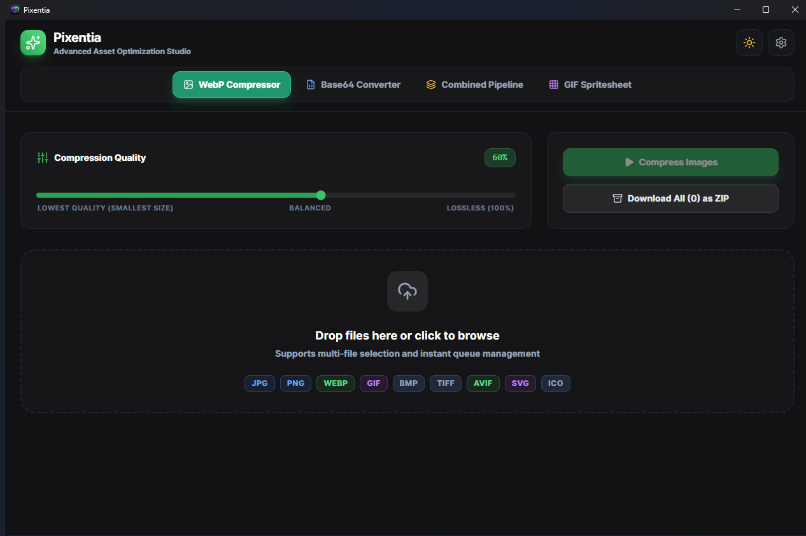

# ⚡ Pixentia Studio

**Pixentia Studio** is a complete, production-ready desktop application built with modern Electron architecture, Node.js, React 19, Vite, and Tailwind CSS. It is designed as a premium developer tool with clean separation of UI, logic, and backend services.



---

## 🚀 Key Features & Capabilities

### 1. Image → WebP Compressor Tool
* **Multi-Format Input:** Drag & drop or select JPG, PNG, JPEG, WEBP, BMP, TIFF, AVIF, SVG, and ICO files.
* **Granular Compression Control:** Premium interactive slider (1–100%) with real-time value display and persistent storage.
* **Advanced Output Management:** Download individual optimized WebP files or instantly bundle all processed assets into a single ZIP archive.
* **Visual Polish:** Dynamic file cards displaying preview thumbnails, original size, compressed size, and percentage change with intuitive green (reduced) and red (increased) indicators.

### 2. Universal Any File → Base64 Converter Tool
* **File Type Agnostic:** Accepts any file format (Images, Videos, PDFs, Documents, Audio, Fonts, Archives).
* **Smart Previews:** Shows high-fidelity image thumbnails for visual assets and appropriate professional file-type icons for documents, videos, and archives.
* **MIME-Qualified Output:** Generates fully qualified Data URI Base64 strings (`data:[mime];base64,...`).
* **Developer Ergonomics:** Provides a prominent "Copy Base64" button with visual clipboard confirmation, alongside collapsible textareas for manual inspection and selection.
* **Customizable Output Formatting:** Features dedicated settings to remove MIME qualifiers, apply custom template strings (e.g., ``), and enable single-click batch copying of all processed strings.

### 3. Sequential Combined Mode (Compress + Base64 Pipeline)
* **Automated Workflow:** Integrates both tools into a seamless two-step pipeline.
* **Intelligent Execution:** Automatically detects image assets, compresses them to WebP using the selected quality threshold, and converts the resulting highly optimized WebP binary into a Base64 Data URI. Non-image files are intelligently routed directly to the Base64 encoder.

### 4. Animated GIF → Lossless Spritesheet Converter Tool
* **Native GIF Parsing:** Automatically extracts frame count, frame rate (FPS), total duration, and original frame dimensions instantly upon loading.
* **Aspect-Locked Dimension Synchronization:** Modify total spritesheet dimensions or individual frame sizes with real-time, two-way proportional synchronization. Ensures exact integer frame scaling for pixel-perfect game engine alignment.
* **Custom Grid Layout:** Real-time adjustment of horizontal grid columns count with custom app-themed stepper controls.
* **Lossless PNG Export:** Composites animated frames onto a transparent canvas and exports them as pristine, uncompressed PNG spritesheets preserving 100% original visual fidelity.
* **Intelligent Conflict Resolution:** Preserves original filenames while automatically appending Windows-style `(1)`, `(2)` conflict counters to prevent accidental overwrites.

### 5. Advanced Queue Management & Persistence
* **Non-Destructive Queuing:** Dragging and dropping additional files appends them to the active queue without overwriting existing items.
* **Automatic Duplicate Prevention:** Prevents identical file paths from being queued multiple times in the same session.
* **Persistent Preferences:** Automatically saves compression quality, custom output directory, theme selection (Light/Dark), and auto-ZIP preferences across application restarts using an IPC-backed JSON store service.

---

## 🏗️ Architecture & Tech Stack

```
pixentia/
├── electron/
│   ├── main.ts          # Main Process: Window management, IPC services, Sharp & Archiver engines
│   └── preload.ts       # Preload Script: Secure contextBridge exposure of electronAPI
├── src/
│   ├── components/      # Modular React UI Components (Header, DropZone, FileCard, SettingsModal)
│   ├── types/           # TypeScript Domain Models & IPC Interfaces
│   ├── App.tsx          # Core Application State & View Routing
│   ├── main.tsx         # React DOM Entry
│   └── index.css        # Tailwind CSS & Custom Component Layers
├── package.json         # Dependencies & Electron Builder Configuration
├── vite.config.ts       # Vite & Electron Plugin Build Pipeline
└── tailwind.config.js   # Design System & Dark Mode Configuration
```

* **Core Framework:** Electron JS (v41) & Node.js
* **Frontend:** React 19 & TypeScript
* **Build Tool:** Vite 5 + `vite-plugin-electron`
* **Styling & UI:** Tailwind CSS v3 + Lucide React Icons
* **Engines:** `sharp` (High-performance image processing), `archiver` (ZIP bundling), `fs-extra` (Filesystem operations)

---

## 🛠️ Installation & Running Locally

### Prerequisites
* **Node.js:** v20.19+ or v22.12+ (Recommended)
* **Git** (optional, for cloning)

### 1. Clone or Open the Project Directory
Navigate to the root directory where Pixentia is scaffolded:
```bash
cd Pixentia
```

### 2. Install Dependencies
Install all required NPM packages, including native modules and dev dependencies:
```bash
npm install
```

### 3. Run the Development Server
Launch the application in development mode with live hot-reloading for both the React frontend and Electron main process:
```bash
npm run dev
```

> **Running from an integrated terminal?** VS Code (and some other Electron-based editors) export `ELECTRON_RUN_AS_NODE=1` into their terminals. That makes `electron.exe` boot as plain Node, and the app crashes at startup with `SyntaxError: The requested module 'electron' does not provide an export named 'BrowserWindow'`. Clear it first:
>
> ```powershell
> $env:ELECTRON_RUN_AS_NODE = $null   # PowerShell
> ```
> ```bash
> unset ELECTRON_RUN_AS_NODE          # bash / zsh
> ```

---

## 📦 Production Build Instructions

Pixentia comes pre-configured with `electron-builder` to generate standalone, production-grade executables and installers for Windows and macOS.

### Building for Windows (NSIS Installer & Portable EXE)
To build the Windows production binaries, run:
```bash
npm run build:electron
```
* **Output Location:** `dist-electron-build/`
* **Artifacts Generated:** `Pixentia Setup [version].exe` (Full Installer, prompts for the install folder) and `Pixentia [version].exe` (Portable Executable).

### Building for macOS (DMG & ZIP)
`electron-builder` can only produce macOS artifacts **on macOS** — the `.dmg` and `.app` formats need Apple tooling that does not exist on Windows or Linux. On a Mac, run:
```bash
npm run build:electron
```
* **Output Location:** `dist-electron-build/`
* **Artifacts Generated:** `Pixentia-[version].dmg` (Disk Image) and `Pixentia-[version]-mac.zip`.

If you do not own a Mac, use the GitHub Actions workflow below — GitHub's hosted macOS runners build it for you.

### Building for Linux (AppImage)
```bash
npm run build:electron
```
* **Artifacts Generated:** `Pixentia-[version].AppImage` (portable, runs on most distros).
* `.deb` / `.rpm` targets are not enabled because `electron-builder` requires a maintainer email for them. To add one, set `"linux": { "maintainer": "Your Name <you@example.com>", "target": ["AppImage", "deb"] }` in `package.json`.

> **Note on Native Dependencies:** `electron-builder` is explicitly configured to unpack `sharp` binaries (`asarUnpack`), ensuring pristine performance and compatibility in production packages without missing native binding errors.

---

## 🤖 Automated Multi-Platform Builds (GitHub Actions)

Two workflows live in `.github/workflows/`:

| Workflow | Trigger | What it does |
| --- | --- | --- |
| `ci.yml` | Every push / PR to `main` | Typecheck + bundle only. Fast and cheap; no installers. |
| `build.yml` | Manual (**Actions → Build → Run workflow**) or pushing a `v*` tag | Packages Windows, macOS (Apple Silicon **and** Intel), and Linux in parallel, then uploads the installers. |

### Running a manual all-platform build
1. Go to the repository's **Actions** tab → **Build** → **Run workflow**.
2. Leave *release* unchecked to get downloadable build artifacts only (kept 30 days), or check it and supply a tag such as `v1.0.0` to also create a **draft** GitHub Release with every installer attached.

Pushing a tag does the same thing automatically:
```bash
npm version 1.0.1        # bumps package.json and creates the v1.0.1 tag
git push --follow-tags
```

The release is created as a **draft** so you can review the assets and write the notes before making it public.

### Artifacts produced per platform

| Platform | Runner | Files |
| --- | --- | --- |
| Windows x64 | `windows-latest` | `Pixentia Setup [version].exe` (NSIS installer), `Pixentia [version].exe` (portable) |
| macOS arm64 | `macos-latest` | `.dmg`, `-mac.zip` |
| macOS x64 | `macos-13` | `.dmg`, `-mac.zip` |
| Linux x64 | `ubuntu-latest` | `.AppImage` |

Both macOS architectures are built on their own native runner rather than cross-compiled, because `sharp` ships per-architecture native binaries and `npm ci` only installs the ones matching the host.

### ⚠️ macOS builds are unsigned
CI sets `CSC_IDENTITY_AUTO_DISCOVERY=false`, so the macOS artifacts are **not code-signed or notarized**. They work, but Gatekeeper blocks the first launch; users must right-click the app → **Open**, or run:
```bash
xattr -cr /Applications/Pixentia.app
```

To ship properly signed builds you need a paid **Apple Developer Program** membership (~$99/year). Then:
1. Export your *Developer ID Application* certificate as a `.p12` and base64-encode it.
2. Add repository secrets: `CSC_LINK` (the base64 `.p12`), `CSC_KEY_PASSWORD`, `APPLE_ID`, `APPLE_APP_SPECIFIC_PASSWORD`, `APPLE_TEAM_ID`.
3. Remove the `CSC_IDENTITY_AUTO_DISCOVERY: false` line from `build.yml` and set `"notarize": true` under `build.mac` in `package.json`.

Signing is *not* required to distribute the app — it only removes the Gatekeeper warning. Windows builds are unsigned too and may show a SmartScreen prompt.

### ⚠️ Windows: nothing happens on launch

On a few Windows systems the app cannot start from inside your user profile. The installer asks where to put it — pick a path outside `C:\Users`, such as `D:\Programs\Pixentia`.

The portable exe unpacks to `%TEMP%` on every run, so it is affected by the same limitation. To keep an existing install where it is, add `--disable-gpu-sandbox` to the shortcut's target.

---

## 🎨 Design System & Theme Support
Pixentia features first-class support for both **Dark Mode** (sleek `#121214` obsidian backgrounds with glassmorphism panels) and **Light Mode** (clean `#f8fafc` soft layouts). Themes can be toggled instantly from the top navigation bar and are persisted automatically.
